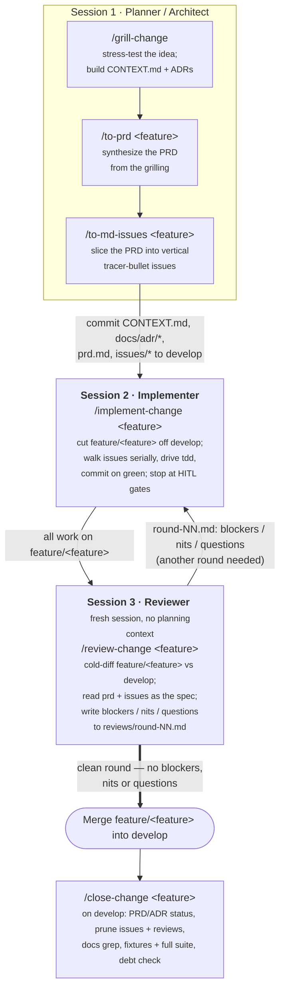

# The Pause — a phased AI development methodology

> *The value is in the pause, not the speed.*

A shareable bundle of Claude Code **skills**, **slash commands**, **engineering standards**, and
**hooks** that encode a specific way of building software with an AI agent: plan adversarially,
implement test-first, review cold — across three deliberately separate sessions, with a human
checkpoint at every boundary.

This repo exists so the methodology can be **handed to another person or team** and adopted in an
afternoon, instead of living only in one engineer's `~/.claude` directory.

> **The core idea:** an AI agent is most dangerous when it's confident and unsupervised across a
> large change. So we split the work into three roles — **Planner**, **Implementer**, **Reviewer** —
> run each in its own session, and force a human decision between phases. The skills automate the
> mechanics within each phase; the human owns the transitions.

---

## The workflow at a glance

A brand-new feature flows through **three sessions** (think: three terminal tabs, or three
Claude Code windows). Each produces committed artifacts the next one consumes.



Why separate sessions? Context isolation. The reviewer must not "remember" the planning rationale —
it should judge the diff against the written spec exactly as a fresh reviewer would. Splitting
sessions is what makes the cold review honest.

### The three sessions, live

In practice the three roles live as separate terminal tabs (**Architect**, **Developer**, **Reviewer**).
A typical moment: the **Developer** tab is mid-run — `implement-change` has read the PRD and all six issue
stubs, printed the **dependency DAG and serial order** (each issue's `Blocked by` line threads the
slices together), and **halted for a pre-flight check** before cutting the feature branch and
starting to build.

---

## Session 1 — Planner / Architect

**Goal:** reach genuine shared understanding of *what* to build, captured as committed artifacts —
before a line of implementation code is written.

### `grill-change [KEY]`
Start from a feature description, a doc or a wiki page pasted into the session — or from a
ticket key (`grill-change PROJ-123`), in which case the skill fetches the ticket and quotes it first.
It then runs Matt Pocock's `grilling` and `domain-modeling` skills: it **interviews you relentlessly**, one decision at a time, walking down the design tree and giving its
recommended answer at each branch. As decisions crystallise it updates two things inline:

- **`CONTEXT.md`** — the project's domain glossary (domain language *only*; no implementation
  detail, no spec content). When you use a term that conflicts with the glossary, it calls it out.
- **`docs/adr/`** — an Architecture Decision Record, offered *sparingly* (only when a decision is
  hard to reverse, surprising without context, and the result of a real trade-off).

You stop when you and the agent agree on what needs to be built.

### `to-prd <feature-name>`
Synthesizes a **Product Requirements Document** from the grilling context — it does *not* re-interview
you. Output: `docs/features/<feature-name>/prd.md` (problem, solution, user stories, implementation
decisions, testing decisions, out-of-scope).

### `to-md-issues <feature-name>`
Slices the PRD into **vertical tracer-bullet issues** — each a thin, end-to-end path through every
layer, demoable on its own. Each issue is classified on two axes: **Type** (`AFK` = agent can build
it / `HITL` = a human must decide something first) and **Verification** (`AFK` / `HITL` = a human
must confirm it works). Output: `docs/features/<feature-name>/issues/<NN>_<slug>.md`, numbered in
dependency order.

**End of Session 1:** commit `CONTEXT.md`, `docs/adr/*`, `prd.md`, and `issues/*` to `develop`.

---

## Session 2 — Implementer

### `implement-change <feature-name>`
Cuts a `feature/<feature-name>` branch off `develop`, then walks the issue stubs **serially, one at a
time**:

- spawns a subagent per issue, driving the **`tdd`** skill (red → green → refactor),
- runs the issue's new tests, then the **full suite**, when the subagent returns — a feature may break
  something existing, so both must be green,
- **commits to the feature branch on green**, then advances to the next issue.

The same skill implements a rework ticket (`implement-change PROJ-123`): the work items are then the
numbered steps in `docs/rework/PROJ-123/ticket.md`, step 0 is always the characterisation tests that
pin current behaviour, and the branch is `rework/PROJ-123`.

It runs unattended *except* at **HITL** issues — those it hands to you and stops. No worktrees, no
parallelism, no per-issue review checkpoint: the output is a clean sequence of commits on
`feature/<feature-name>`.

> This methodology ships only the **auto** (serial, unattended) implementer. A parallel,
> review-checkpointed variant exists in the wild but is intentionally not included here — start
> simple.

**End of Session 2:** all work committed to `feature/<feature-name>`.

---

## Session 3 — Reviewer

### `review-change <feature-name>`
Run this in a **fresh session with no planning context** — that's the whole point. It:

- diffs `feature/<feature-name>` against `develop` with `git`,
- reads `prd.md` and the issue stubs as the **spec** the work is judged against,
- writes findings — split into **blockers**, **nits**, and **questions** (clarifications it needs
  from you) — to `docs/features/<feature-name>/reviews/round-NN.md`.

**The loop:** feed `round-NN.md` back to Session 2, fix, then re-run `review-change` (it writes
`round-02.md`, `round-03.md`, …). Repeat until a round comes back with **no blockers, no nits, no
questions**. Then merge, and run `/close-change <feature-name>` on the integration branch: it
sets the PRD and ADR status, deletes the issue stubs and review rounds, greps the docs for identifiers
the release removed, and confirms fixtures are tracked and the full suite passes. A feature is not
done until it has run clean.

### Hardening test quality — `mutation-testing`
Once tests are green and the review is clean, optionally run `mutation-testing` to find gaps in test
*quality*: it injects code mutations and reports which ones your tests fail to catch (a surviving
mutant = a test gap). It asks you for the tool, source paths, and exclusions before running.

---

## The rework lane — tickets, not features

Not every change is a feature. A refactor, a dead-code removal, a docs prune or a ticket-driven
improvement that leaves behaviour unchanged has no user stories to slice, so a PRD would be ceremony.
The rework lane keeps the same four sessions and the same shared skills, and swaps only the
planning artefact:

| Stage | Feature lane | Rework lane |
|---|---|---|
| Understand | `grill-change` on the idea | `grill-change <KEY>` — fetches the ticket, quotes it, then grills you |
| Freeze | `to-prd` + `to-md-issues` → `docs/features/<name>/` | `to-rework <KEY>` → `docs/rework/<KEY>/ticket.md`: ticket, plan, **Acceptance**, numbered **Steps** |
| Implement | `implement-change <name>` on `feature/<name>`, one commit per issue | `implement-change <KEY>` on `rework/<KEY>`, one commit per step; **step 0 is always the characterisation tests** that pin current behaviour |
| Review | `review-change <name>` against the PRD and issues | `review-change <KEY>` against `ticket.md`; the bar is "behaviour unchanged" |
| Close | `close-change <name>`: status headers, prune `issues/` + `reviews/` | `close-change <KEY>`: delete `docs/rework/<KEY>/` — the tracker is the record |

The three downstream skills resolve the lane from which spec exists (`grill-change` takes it from its argument), so you never tell them which lane
you are in. The commit that lands `ticket.md` on `develop` before the branch is cut, and the
`Close <KEY>` commit that deletes it after the merge, are the two markers of a rework in history.

### The two lanes side by side — and where the branch is cut

Nothing before `implement-change` touches a git branch. Session 1 ends with the spec committed on
`develop`, so the change branch, when it is cut, already contains it — the implementer and the
reviewer find the spec in their checkout without merging anything.

```text
Feature lane                            Rework lane
────────────────────────────────────    ────────────────────────────────────
grill-change            (on develop)    grill-change <KEY>        (on develop)
to-prd + to-md-issues   (on develop)    to-rework <KEY>           (on develop)
  └─ commit prd.md + issues/*             └─ commit ticket.md
        to develop                              to develop
                    ↓                                       ↓
implement-change <name>                 implement-change <KEY>
  └─ git checkout -b feature/<name>       └─ git checkout -b rework/<KEY>
        from develop        ◄── BRANCH CREATED HERE ──►      from develop
  └─ one commit per issue                 └─ one commit per step, step 0 first
                    ↓                                       ↓
review-change <name>                    review-change <KEY>
  └─ diffs feature/<name> vs develop      └─ diffs rework/<KEY> vs develop
  └─ writes reviews/round-NN.md           └─ writes reviews/round-NN.md
        on the change branch                    on the change branch
                    ↓                                       ↓
merge to develop                        merge to develop
close-change <name>     (on develop)    close-change <KEY>        (on develop)
```

---

## Supporting skills & commands

| Tool | Role |
|------|------|
| `to-rework` | Freeze a grilled rework ticket into `docs/rework/<KEY>/ticket.md` — ticket, plan, Acceptance, numbered Steps with step 0 = characterisation tests. The rework twin of `to-prd`. |
| `close-change` | Close a shipped change (feature or rework ticket) so the repo matches reality: status headers, prune `issues/` + `reviews/`, docs-drift grep, fixture + suite check, debt pass. Run at the merge or version-bump commit. |
| `handoff` | Compact one session's context into a hand-off doc for the next — the practical bridge **between the three sessions/tabs**. |
| `diagnose` | Disciplined debugging loop (reproduce → minimise → hypothesise → instrument → fix → regression-test) for hard bugs and perf regressions. |
| `/check` | Run the full quality gate (lint, format, type-check, security scan, tests). *Python/Databricks-specific.* |
| `/debt-check` | Scan current work for cognitive debt — magic numbers, undocumented business rules, unvalidated assumptions. |
| `/debt-review` | Summarise accumulated cognitive debt from `.claude/cognitive_debt.md` into a prioritised action list. |

---

## What's in this repo

```
the-pause/
├── README.md                          # this file
├── LICENSE                            # MIT, for everything original here
├── ATTRIBUTION.md                     # who authored which skill, plus upstream licence notice
├── settings.example.json              # hooks + sensible defaults to copy
├── standards/
│   ├── CLAUDE.md                      # stack-agnostic methodology + standards (repo root)
│   └── rules/                         # topic rules → <repo>/.claude/rules/
│       ├── testing.md                 # stack-agnostic testing standards (always install)
│       ├── python-tooling.md          # Python: ruff/pyright/bandit/pytest conventions
│       └── databricks-pipelines.md    # PySpark / Delta / DAB config, patterns, deployment
├── skills/                            # 11 skills (see ATTRIBUTION.md for provenance)
│   ├── tdd/  diagnose/  handoff/                           # Matt Pocock's (vendored)
│   ├── to-prd/  to-md-issues/                              # derived from Matt Pocock's
│   ├── to-rework/                                          # ours (rework-lane twin of to-prd)
│   └── grill-change/  implement-change/  review-change/  close-change/  mutation-testing/   # ours
├── commands/
│   ├── check.md  debt-check.md  debt-review.md             # active
│   └── _deprecated/research.md  _deprecated/spec.md        # see "Evolution" below
└── hooks/
    └── capture_decisions.sh           # appends DECISION/ASSUMPTION/DEBT markers to cognitive_debt.md
```

---

## Adopting it on your machine

1. **Standards.** Copy `standards/CLAUDE.md` to the root of your repo as `CLAUDE.md`, and copy
   `standards/rules/testing.md` into `<repo>/.claude/rules/`. If you're on Python + Databricks, also
   copy `python-tooling.md` and `databricks-pipelines.md` there. Rules load alongside `CLAUDE.md` at
   session start; keeping each file under ~200 lines is what keeps adherence high, so don't
   concatenate them. The `## Agent skills` block at the top of `CLAUDE.md` is **pre-configured for
   local-markdown issues** — no setup step required.

2. **Skills.** Symlink each directory under `skills/` into `~/.claude/skills/` (user-wide) or
   `<repo>/.claude/skills/` (per-project) — `ln -s <the-pause>/skills/<name> ~/.claude/skills/<name>`,
   one link per skill so the profile can hold skills of its own beside them. A link makes this
   checkout the single source of truth: an edit here is live in the next session, so edit on
   `main` and commit promptly. Copy instead of linking only if the profile lives on another machine.
   Read `ATTRIBUTION.md` first — you may prefer to install
   Matt Pocock's three vendored skills directly from
   [`mattpocock/skills`](https://github.com/mattpocock/skills) rather than use the copies here.
   `grill-change` additionally needs his `grilling` and `domain-modeling` skills installed from
   that repository; they are not vendored.

3. **Commands.** Copy `commands/*.md` into `~/.claude/commands/` (or `<repo>/.claude/commands/`).
   `/check` assumes Python/Databricks — adapt or skip it otherwise.

4. **Hook (optional).** Copy `hooks/capture_decisions.sh` to `<repo>/.claude/hooks/` and merge the
   `PostToolUse` entries from `settings.example.json` into your `.claude/settings.json`. This
   auto-captures `# DECISION:` / `# ASSUMPTION NEEDED:` / `# DEBT:` comments into
   `.claude/cognitive_debt.md` (currently Python-file-scoped).

There is **no external install and nothing phones home** — everything here is local files you copy
into place.

---

## Evolution of the planning phase

Earlier versions of this workflow planned with two slash commands that produced static documents:

- `/research` — write a research document analysing the code, then get sign-off.
- `/spec` — write a structured spec, then get sign-off.

These are preserved under `commands/_deprecated/` for historical reference and are **superseded** by
the grilling skills. The shift: a one-shot document you write *for* the human gets rubber-stamped;
an **adversarial interview** that forces a decision at every branch of the design tree surfaces the
disagreements a static doc papers over. `grill-with-docs` (today wrapped by `grill-change`) replaced `/research` + `/spec` because the
*conversation* is where shared understanding actually forms — and it drops the durable output
(`CONTEXT.md`, ADRs, then the PRD) as a side effect of the dialogue rather than as the goal.

Don't use the deprecated commands in the current workflow; they're documentation of why the
methodology changed.

---

## Credits

The planning and TDD skills originate with **Matt Pocock** ([`mattpocock/skills`](https://github.com/mattpocock/skills)).
See [`ATTRIBUTION.md`](./ATTRIBUTION.md) for a precise breakdown of what was authored where, what was
derived, and what is original to this repo.
